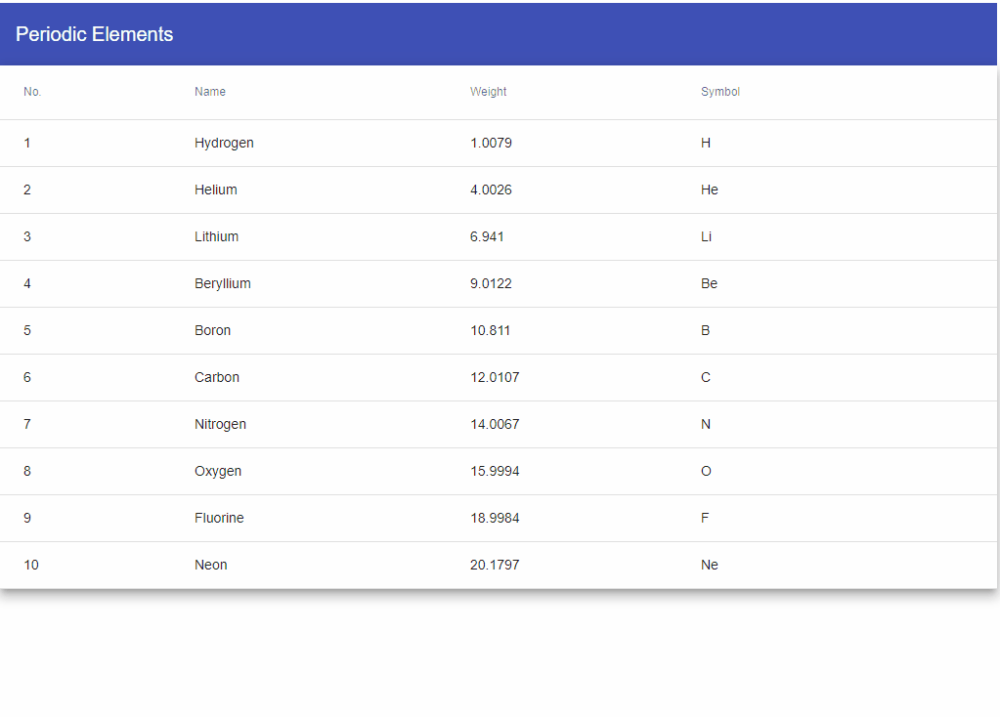

# Angular Material Table Selection with Arrow

Moving the selection inside Angular Material Table with Arrow Keys.

# Preview



# Stackblitz

https://stackblitz.com/edit/angular-keynav-table

# Component
```typescript
import {AfterViewInit, Component, ElementRef, OnInit, ViewChild} from '@angular/core';
import {MatTableDataSource} from "@angular/material";
import {PeriodicElement} from "../model/periodic-element";
import {PeriodicElementService} from "../service/periodic-element.service";
import {SelectionModel} from "@angular/cdk/collections";

@Component({
  selector: 'app-periodicelement-table',
  templateUrl: './periodicelement-table.component.html',
  styleUrls: ['./periodicelement-table.component.scss']
})
export class PeriodicelementTableComponent implements OnInit, AfterViewInit {

  displayedColumns: string[] = ['position', 'name', 'weight', 'symbol'];
  dataSource = new MatTableDataSource<PeriodicElement>();
  selection = new SelectionModel<PeriodicElement>(false, []);

  @ViewChild('table', {static: true, read: ElementRef}) table: ElementRef;
  private rows: NodeListOf<HTMLElement>;

  constructor(private periodicElementService: PeriodicElementService) {
  }

  ngOnInit() {
    this.getPeriodicElements();
  }

  ngAfterViewInit(): void {
    this.getTableRows();
  }

  selectPrevious(row: PeriodicElement) {
    const currentIndex = this.getCurrentIndex(row);
    if (currentIndex > 0) {
      let previousRow = this.rows[currentIndex - 1];
      this.selection.toggle(this.dataSource.data[currentIndex - 1]);
      previousRow.focus();
    }
  }

  selectNext(row: PeriodicElement) {
    const currentIndex = this.getCurrentIndex(row);
    if (currentIndex < this.dataSource.data.length - 1) {
      let nextRow = this.rows[currentIndex + 1];
      this.selection.toggle(this.dataSource.data[currentIndex + 1]);
      nextRow.focus();
    }
  }

  edit() {
    console.log('edit', this.selection.selected[0]);
  }

  private getCurrentIndex(row) {
    return this.dataSource.data.findIndex(r => r === row)
  }

  private getPeriodicElements() {
    this.dataSource.data = this.periodicElementService.list;
  }

  private getTableRows() {
    let el = this.table.nativeElement;
    this.rows = el.querySelectorAll('mat-row, tr[mat-row]');
  }
}
```
The tabindex in TR is mandatory for selection.
```html
<table #table mat-table [dataSource]="dataSource" class=" mat-elevation-z8"
       matSort matSortActive="position" matSortDirection="asc" matSortDisableClear>
  <ng-container matColumnDef="position">
    <th mat-header-cell *matHeaderCellDef> No.</th>
    <td mat-cell *matCellDef="let element"> {{element.position}}</td>
  </ng-container>

  <ng-container matColumnDef="name">
    <th mat-header-cell *matHeaderCellDef> Name</th>
    <td mat-cell *matCellDef="let element"> {{element.name}}</td>
  </ng-container>

  <ng-container matColumnDef="weight">
    <th mat-header-cell *matHeaderCellDef>Weight</th>
    <td mat-cell *matCellDef="let element"> {{element.weight}}</td>
  </ng-container>

  <ng-container matColumnDef="symbol">
    <th mat-header-cell *matHeaderCellDef>Symbol</th>
    <td mat-cell *matCellDef="let element"> {{element.symbol}}</td>
  </ng-container>

  <tr mat-header-row *matHeaderRowDef="displayedColumns"></tr>
  <tr tabindex="999" mat-row *matRowDef="let row; columns: displayedColumns;"
      (click)="selection.toggle(row)"
      (keydown.arrowDown)="selectNext(row)"
      (keydown.arrowUp)="selectPrevious(row)"
      (keydown.enter)="edit()"
  ></tr>
</table>
```


 
